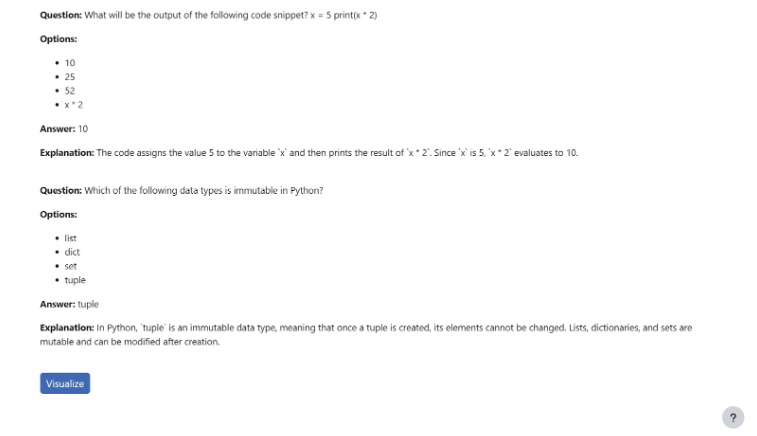
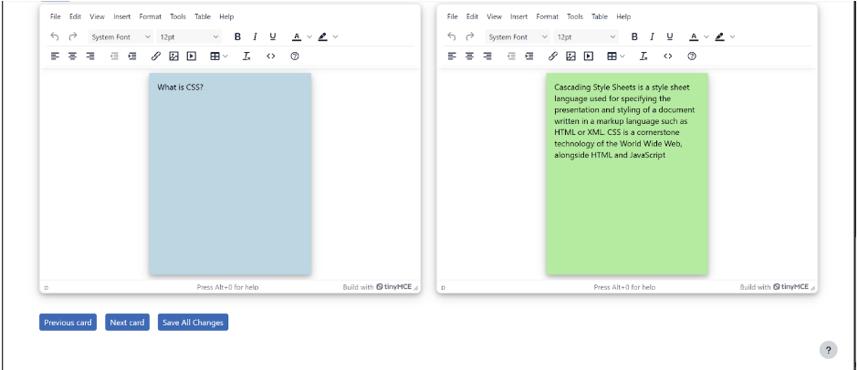

# Flashcards

## Installation

This is necessary for being able to run the flashcard generation functions.

**Moodle Flashcard Plugin Zip Folder**:  
[Flashcard Folder](https://github.com/Tec-Wel/LMS/tree/main/flashcard)

Or you can download here if the above one doesn’t work for you:  
[Moodle plugins directory: Flash Card Set | Moodle.org](https://moodle.org/plugins/view.php?plugin=mod_flashcard)

The first one is modified. The `styles.css` (flashcard design) is changed and fixed an issue with the remaining cards number not displaying on the screen.

It is recommend to try to download the first link first since it’s more updated to what we are doing, but the second one is fine to just have the flashcard databases/functionality if the first link does not work. Downloading the plugin creates the flashcard tables so you can run the flashcard generation functions on your local.

## Flashcard Visualization Setup

1. Run this command in your Moodle database:

   ```sql
   CREATE TABLE mdl_custom_flashcard_storage (
     id BIGINT(20) UNSIGNED NOT NULL AUTO_INCREMENT,
     title VARCHAR(255) CHARACTER SET utf8mb4 COLLATE utf8mb4_unicode_ci NOT NULL,
     question TEXT CHARACTER SET utf8mb4 COLLATE utf8mb4_unicode_ci NOT NULL,
     answer TEXT CHARACTER SET utf8mb4 COLLATE utf8mb4_unicode_ci NOT NULL,
     user_id INT(11) NOT NULL,
     template_id INT(11) NOT NULL,
     font_css_styles TEXT CHARACTER SET utf8mb4 COLLATE utf8mb4_unicode_ci DEFAULT NULL,
     card_css_styles TEXT CHARACTER SET utf8mb4 COLLATE utf8mb4_unicode_ci DEFAULT NULL,
     created_at BIGINT(10) DEFAULT NULL,
     week BIGINT(10) DEFAULT NULL,
     course BIGINT(10) DEFAULT NULL,
     updated_at BIGINT(10) DEFAULT NULL,
     PRIMARY KEY (id)
   );
   ```

   `mdl_custom_flashcard_storage` is the table used to store the generated flashcard content and styles for displaying on course-generated pages. Some of the column names might need to be removed or modified later depending on the best way to store the HTML/CSS of the flashcards. Only `id`, `question`, and `answer` are used currently.

   If the user approves the course-generated content for flashcards and the flashcard visualization, we can use this data to update the flashcard plugin databases.

2. Run this command in your Moodle directory:

   ```bash
   composer require tinymce/tinymce
   ```

   This installs the TinyMCE editor used for modifying the flashcard text.

## Usage/Testing Flashcard Visualization

1. Make sure to import the `visualization.php` file relative to your current directory:

   ```php
   require_once(dirname(__DIR__) . '/course_generation/visualization.php');
   ```

2. Function for displaying flashcards:

   ```php
   display_flashcards($flashcards, $course, $week);
   ```

   This function is in `visualization.php`.

   To test the display for yourself, just call this within a page:

   ```php
   display_visual_flashcards(2, 2, null);
   ```

   The function is:

   ```php
   function display_visual_flashcards($course, $week, $flashcard_data) {
       // Temporary flashcards questions and answers
       $flashcards = array(
           array('question' => 'What is PHP?', 'answer' => 'PHP is a server-side scripting language.'),
           array('question' => 'What is JavaScript?', 'answer' => 'JavaScript is a client-side scripting language.'),
           array('question' => 'What is Python?', 'answer' => 'Python is a high-level, interpreted programming language known for its readability and versatility.')
       );
       // Convert associative arrays to objects
       $flashcards = json_decode(json_encode($flashcards));
   }
   ```

   - First two params (`$course` and `$week`) don’t really matter what you put in right now as long as you use different numbers every time you call `display_visual_flashcards()`.

   - `$flashcard_data` can be `null` for testing purposes, which will just use simulated flashcard data.

## Modifying Flashcard Visualization

- **HTML and Retrieving Flashcard Data** → `local/course_generation/visualization.php`

- **JavaScript for Handling TinyMCE Editor, Visualize Button, Flashcard Pagination, Saving Flashcards** → `local/course_generation/js/flashcard_visual.js`

- **Saving Data to Database `mdl_custom_flashcard_storage`** → `local/course_generation/save_flashcard_visual.php`

If you modify the JavaScript file, it’s better to do a hard page refresh than a normal page refresh, or your changes might not show due to caching. You can do a hard refresh by opening Inspect Element on the page, then right-clicking the refresh button and clicking "Hard Refresh".

**TinyMCE Docs**: [Getting Started | TinyMCE Documentation](https://www.tiny.cloud/docs/)

## Flashcard Visualization Pictures

- **Visualize Button**:



- **Flashcard Visual with TinyMCE Editor (after clicking visualize)**:


